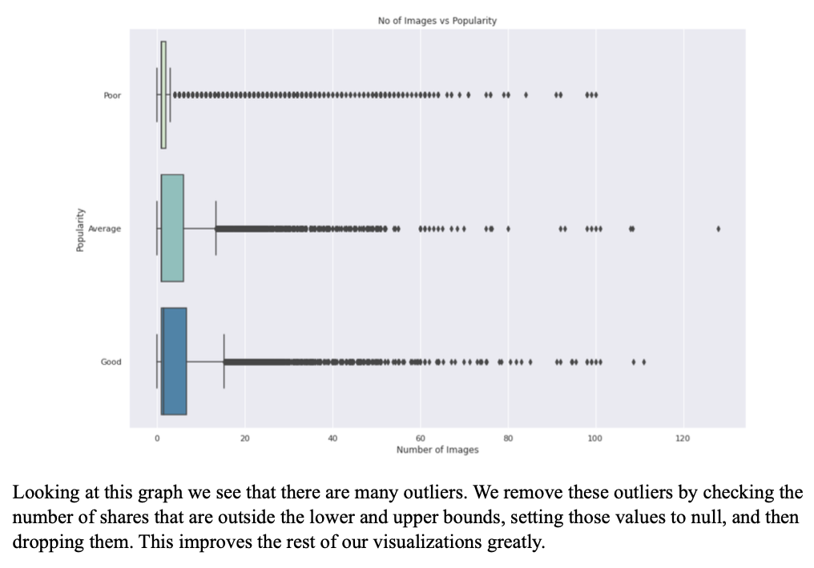
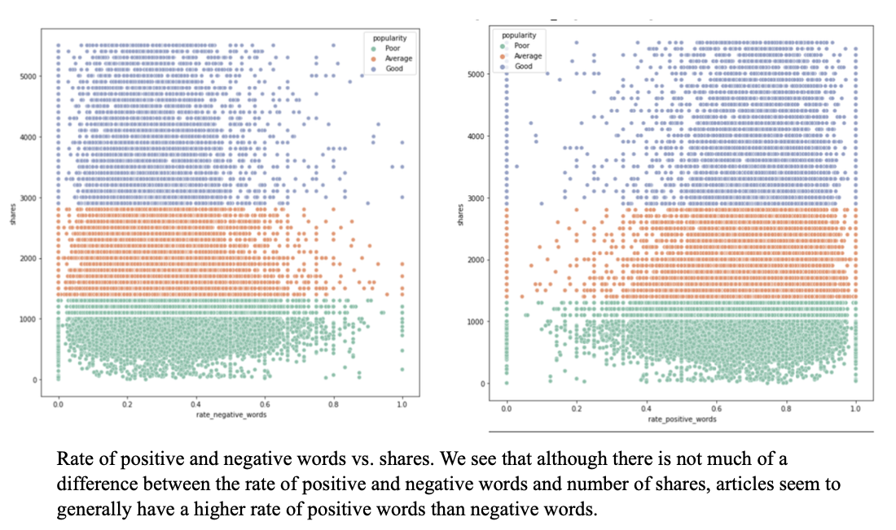
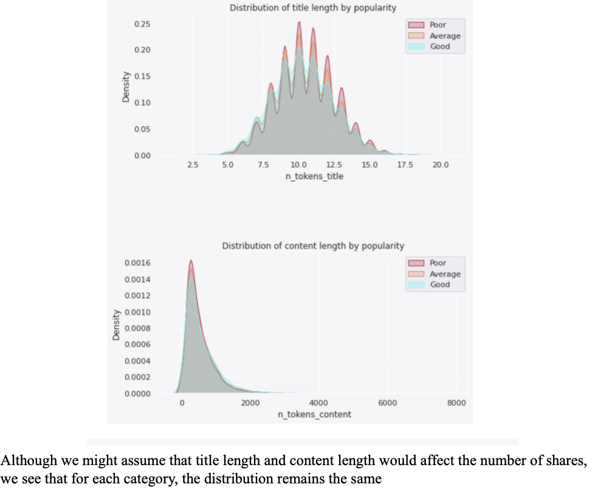
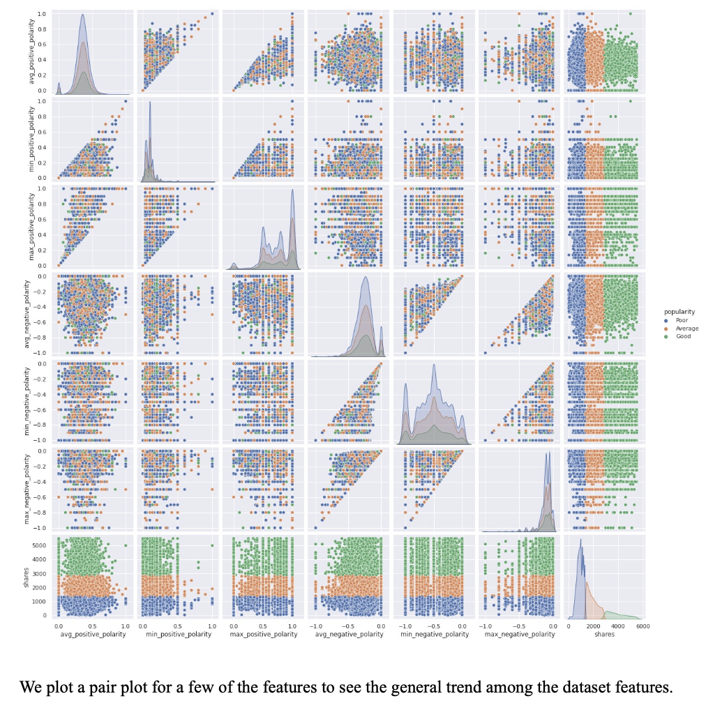

With changing times all forms of media are shifting from print to digital, news is no exception. For
news outlets, publishing news articles online can prove to be a step up from traditional newspapers
because user interaction can be taken into consideration to assess if an article proved to be popular
or not. 

The online news popularity dataset is a collection of certain statistics that could help us
predict the popularity of online news. The dataset keeps a record of factors such as the number of
words in an article, number of images, day of the week it was published on etc. The goal of our
project is to use this information to extract common features among popular articles that can be put
to use in future publications, and predict the extent of news popularity.

Due to the size of the dataset we plan to reduce the number of attributes by implementing
dimensionality reduction. We will then be implementing regression models on the data and set
threshold values for low, moderate, and high popularity based on shares. Visualizations will be used
to observe patterns that good articles have in common as well as explore relationships between
`shares` and other predictive attributes.

# Exploratory Data Analysis 

The regression models that have been constructed include Linear Regression, KNN, Decision Tree,
Random Forest, and Neural Networks. Root Mean Squared Error and Mean Absolute Error are
used as the evaluation metric.

# Results 

The Dense Neural Network and Random Forest have the best overall performance, some other results we can infer are as follows:

- The execution time for Random Forest is notably lower than Neural Network, as it takes a few
seconds as opposed to several minutes for DNN

- Our KNN model for the sampled data shows the most ideal learning curve, with low overfitting
(low variance). However, it is not a feasible model to implement considering the size of our
dataset

- Random Forest and Neural Networks algorithms also allow for more tuning due to the number of
hyper parameters that can be changed

- It can be noted that by selecting different features, or by taking different percentage of features
than what has been used for our models, the performance could be improved
